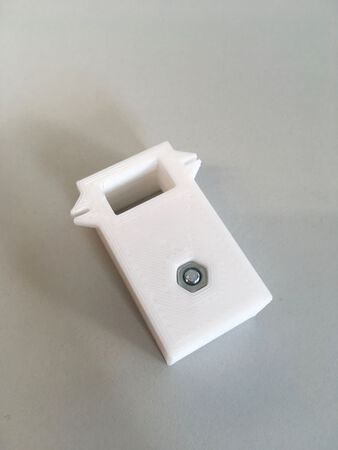

Use an TCRT5000 sensor as Energy Meter for old Ferraris counters.  
Fix PCB with 1x M3 screw and nut.

See [GitHub Releases](https://github.com/dersimn/TCRT5000-holder/releases) for "compiled" versions of the .ipt/.iam files.